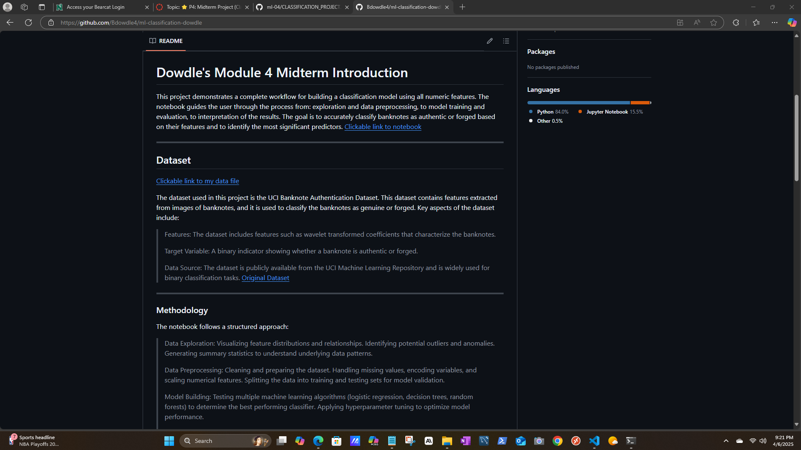

# 🧑‍🤝‍🧑 Peer Review: Applied Machine Learning Midterm Project

**Reviewer:** Jason A. Ballard  
📍 **Date:** April 2025  
📘 **Notebook Reviewed:** [Classification Project – Brittany Dowdle](https://github.com/Bdowdle4/ml-classification-dowdle/blob/main/classification_dowdle.ipynb)  
👤 **Author Reviewed:** [Brittany Dowdle](https://github.com/Bdowdle4)

---

_This was very well done- and the suggestions were hard to determine_
_JB_

---

## ✅ 1. Clarity & Organization

> 

The notebook is **well-organized and easy to follow**. Each section is clearly labeled and flows logically from data loading to final evaluation. The Markdown usage and inline comments make it accessible to readers at all levels.

> ⭐ **Positive:** Markdown sections and visualizations are used effectively.  
> 🛠 **Suggestion:** Add a brief TL;DR or "Key Takeaways" section at the top summarizing the dataset, model choice, and final results.

---

## ✅ 2. Feature Selection & Justification

The selected features are **clearly explained** and backed by a mix of domain knowledge and statistical reasoning. Including all original features in the initial run makes sense given their independent value. The creation of the `Kurtosis_Entropy` interaction feature shows good intuition, even if it didn’t boost performance.

> ⭐ **Positive:** Good use of feature interaction to explore deeper patterns.  
> 🛠 **Suggestion:** Consider testing additional interactions or running a feature importance plot to visualize impact. The author mentions this in **Section 6 Final Thoughts and Insights**

---

## ✅ 3. Model Performance & Comparisons

The author implemented both a **Random Forest (primary)** and **Decision Tree (secondary)** classifier. Evaluation was thorough, using accuracy, precision, recall, F1-score, and confusion matrices. The use of **ROC curves** and **cross-validation** strengthened the model validation.

> ⭐ **Positive:** Robust evaluation with cross-validation and visual tools.  
> 🛠 **Suggestion:** A simple model comparison table or bar chart would make it easier to visually compare performance across metrics.
>

---

## ✅ 4. Reflection Quality

The reflections were honest and insightful. The author discussed technical decisions, performance interpretation, and even the surprise of extremely high accuracy (which is a good sign you critically evaluated results). agian the author shared insight  about **checking for duplicates to avoid data leakage** — excellent point.

> ⭐ **Positive:** Thoughtful self-assessment and discussion of trade-offs. Well done.
> 🛠 **Suggestion:** Consider condensing a few repeated ideas for even stronger impact and flow.

---

## 📌 Summary

This is a **high-quality, well-documented notebook** that demonstrates a solid understanding of classification modeling and evaluation. The refelections addressed both the technical and analytical sides of the project, used helpful visualizations, and backed your decisions with reasoning. With minor enhancements—like model comparison visuals and more feature experimentation—this already excellent project could reach an even higher level.

> ✅ **Final Verdict:** Well-done and insightful! Great work.

⭐ Review completed by Jason Ballard
⭐ A GenAI assistant platform was used to proof, edit, and generate icons used in this document.
