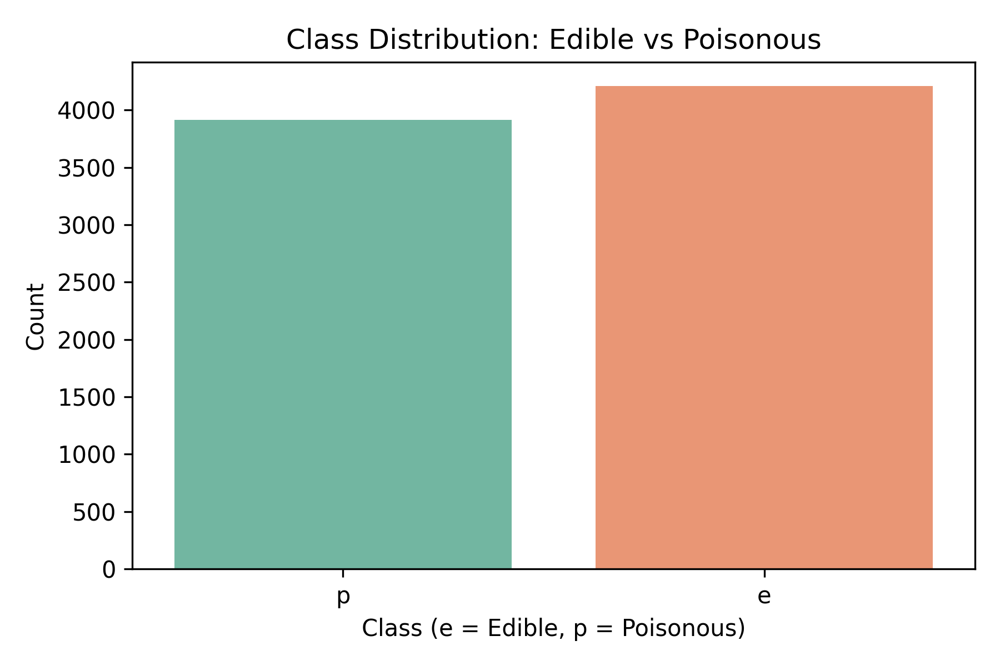
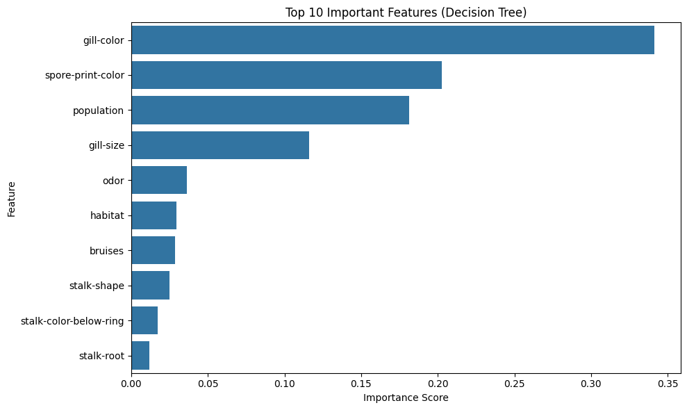
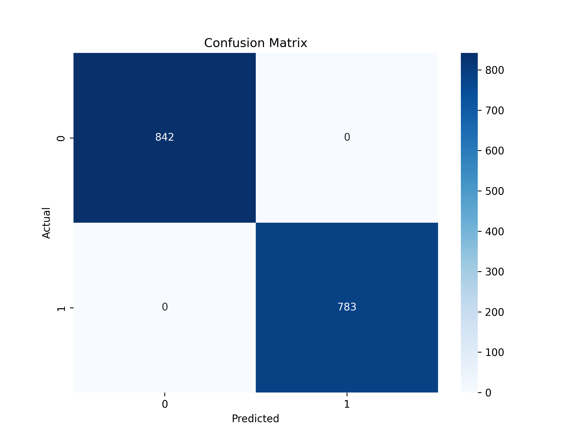
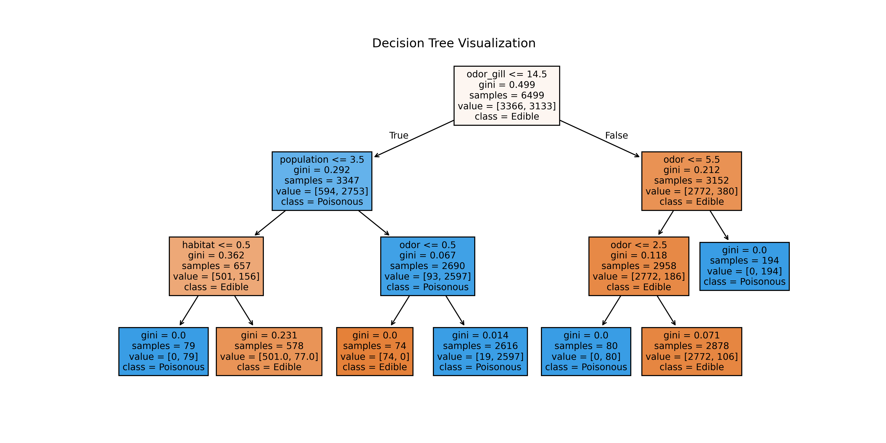

# Applied Machine Learning Mid-term


## 🧑‍💼 Jason A. Ballard  

### Instructional Systems Specialist | Data Scientist | Data and AI Officer | Data Literacy Advocate | Educator in Professional Military Education

Welcome! I'm Jason A. Ballard, an experienced leader in data and AI integration, currently serving as the Data and AI Officer for the US Army Combined Arms Center at Fort Leavenworth, Kansas. My work bridges data science, AI strategy, and higher education, focusing on transforming decision-making through data literacy and innovation.

I invite you to explore my GitHub repository, [jbtallgrass](https://github.com/JBtallgrass?tab=repositories), where I share insights, tools, and resources focused on data literacy and advanced analytics in educational contexts. My projects emphasize practical solutions, open collaboration, and a commitment to enhancing data accessibility across teams.

### 🔑 Key Areas of Focus

- **Data Strategy & Governance**: Developing frameworks that promote data-driven decision-making and cross-departmental data sharing.  
- **AI & Analytics**: Leveraging data analytics and GenAI to unlock insights and drive transformational initiatives within the Army University.  
- **Data Literacy & Education**: Equipping leaders and students with data literacy skills critical for today's complex, data-rich environments.  

📍 **LinkedIn**: [Jason A. Ballard](https://www.linkedin.com/in/jasonaballard)  
📍 **GitHub**: [jbtallgrass](https://github.com/JBtallgrass)

---

## Applied Machine Learning Midterm Project: Classification Analysis

### Jason Ballard

#### Basehor, Kansas (CDT)

#### April 6, 2025  

> 📁 Submission: GitHub Repository with Jupyter Notebook and Peer Review  

---

## **TL;DR:**

This project uses Decision Tree and Random Forest classifiers to predict mushroom toxicity using UCI’s Mushroom dataset. With carefully selected features (including an engineered interaction feature), the models achieved near-perfect accuracy. Full ML pipeline, visualizations, and reflections included.

---

## 📚 Table of Contents

- [Project Overview](#project-overview)
- [Dataset Used](#dataset-used)
- [Project Findings](#project-findings)
- [Goals](#goals)
- [Data Source](#data-source)
- [Technologies Used](#technologies-used)
- [Key Features](#key-features)
- [Setup and Requirements](#setup-and-requirements)
- [Project Structure](#project-structure)
- [Final Overview: The Full Data Flow](#final-overview-the-full-data-flow)
- [Submission Checklist](#submission-checklist)
- [Links](#links)

---

## Project Overview

Organizations frequently need to classify data to support decision-making.
For example, a healthcare provider may want to predict whether a patient has a specific condition based on lab results,
or a business may classify customer behavior to tailor marketing strategies.
Machine learning classification models help automate these decisions by recognizing patterns in historical data.

This project demonstrates the ability to apply classification modeling techniques to a real-world dataset. You will:

- Load and explore a dataset.
- Analyze feature distributions and consider feature selection.
- Train and evaluate a classification model.
- Compare different classification approaches.
- Document your work in a structured Jupyter Notebook.
- Conduct a peer review of a classmate’s project.

---

## Dataset Used

**Mushroom Classification Dataset** (Predict whether a mushroom is edible or poisonous based on characteristics)  
🔗 [UCI Mushroom Dataset](https://archive.ics.uci.edu/ml/datasets/mushroom)



## Project Findings

---

## ✅ **Project Summary: Mushroom Classification**

This project explored the application of machine learning classification techniques using the UCI Mushroom dataset. The goal was to build and evaluate models that could accurately predict whether a mushroom is **edible** or **poisonous** based on its physical and environmental features.

---

### 🔍 **Key Steps & Insights**

#### 📁 **Data Preparation**

- The dataset consisted entirely of **categorical features**, describing mushroom traits like **odor**, **gill color**, and **habitat**.
- A key data issue was that missing values in the `stalk-root` column were marked with `'?'`. These were manually cleaned and imputed using the mode.
- All categorical variables were **label encoded**, which was ideal for tree-based models.

#### 📊 **Exploratory Analysis**



- Features like **odor**, **spore-print-color**, and **gill-color** showed strong class separation.
- An engineered interaction feature, **`odor_gill`**, combining odor and gill color, was created and turned out to be the **most influential** predictor.
- A **scatter matrix and feature importance plot** helped visualize top predictors.

#### 🛠 **Feature Selection**

- Six features were selected based on domain relevance and decision tree feature importance:
  - `odor`, `gill-color`, `spore-print-color`, `habitat`, `population`, and the engineered `odor_gill`.

#### 🤖 **Model Training**

- The data was split using **StratifiedShuffleSplit** to maintain class balance.
- Two classification models were trained:
  - A **Decision Tree Classifier** (primary model)
  - A **Random Forest Classifier** (alternative model)

#### 📈 **Model Evaluation**




- The **Decision Tree** achieved over **99%** across all metrics (accuracy, precision, recall, F1-score).
- The **Random Forest** model achieved a perfect **100%** on all metrics.
- Both models performed exceptionally well due to the high quality and low noise of the dataset.

#### 📊 **Model Comparison**

- The Random Forest slightly outperformed the Decision Tree.
- A markdown-style **comparison table** clearly presented model performance across metrics.

---

### 🧠 **Reflections & Learning**

- The project highlighted how a small number of well-chosen features (especially engineered ones like `odor_gill`) can drive high model accuracy.
- Tree-based models were a great fit for this fully categorical dataset, and **ensemble methods** like Random Forest proved especially powerful.
- Hands-on work with preprocessing, feature engineering, and evaluation reinforced a deep understanding of the full ML workflow—from raw data to insights.

---

### 🚀 **Future Work**

If more time were available, future extensions could include:

- Comparing with additional classifiers (e.g., SVM, MLP)
- Testing **one-hot encoding** vs. label encoding
- Adding **SHAP or LIME explainability tools**
- Creating a simple dashboard or API to make the model interactive

**Please refer to the detailed [Reflections.md](reflections.md) for section-based insights, observations, and reflections captured throughout the modeling process.**

---

## Goals

- Develop a robust classification pipeline
- Evaluate model performance using multiple metrics
- Reflect critically on decisions made throughout the process

---

## Data Source

- **Dataset**: Mushroom Classification Dataset  
- **Link**: [UCI Repository](https://archive.ics.uci.edu/ml/datasets/mushroom)

---

## Technologies Used

- Python (Pandas, NumPy, Scikit-learn, Matplotlib, Seaborn)
- Jupyter Notebook
- Git & GitHub

---

## Key Features

- End-to-end ML workflow
- Label encoding for categorical data
- Stratified sampling for balanced class distribution
- Model comparison: Decision Tree vs. Random Forest
- Evaluation using Accuracy, Precision, Recall, F1-Score

---

## Setup and Requirements

1. Clone the repository
2. Set up a virtual environment  
3. Run `pip install -r requirements.txt`  and `pip freeze > requirements.txt`
4. Launch the Jupyter Notebook

---

## Project Structure

```plaintext
├── data/                           # Dataset folder
├── images/                         # Banner and visualizations
├── ml-04-midterm-jballard.ipynb    # Main notebook
├── README.md                       # Project overview and summary
├── Reflections.md                  # All reflections (linked in README)
├── peer_review.md                  # Your review of a peer project
```

---

## Final Overview: The Full Data Flow

### Assignment Requirements

1. Introduction
2. Data Loading & Inspection
3. Data Cleaning & Preparation
4. Feature Selection & Engineering
5. Model Training & Evaluation
6. Model Comparison
7. Reflections
8. Peer Review

---

## Submission Checklist

- [x] Jupyter Notebook: `ml-04-midterm-jballard.ipynb`
- [x] Reflections: `Reflections.md`
- [x] README: This file
- [x] Dataset in `data/` folder
- [x] Peer Review: `peer_review.md`

---

## Links

- 📘 [Notebook Preview](ml-04-midterm-jballard.ipynb)  
- ✍️ [Reflections (Markdown)](Reflections.md)  
- 🧑‍🤝‍🧑 [Peer Review](peer_review.md)

⭐ Document completed by Jason Ballard
⭐ A GenAI assistant platform was used to proof, edit, and generate icons used in this document.
