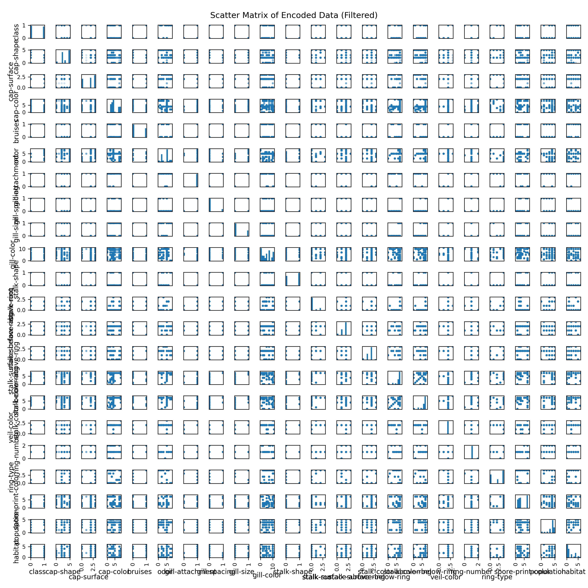
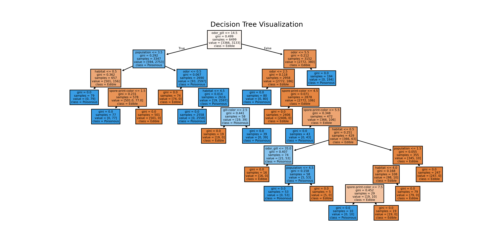

# 📝 Reflections

## ✅ Section 1: Initial Data Inspection

### Class Distribution

### Cleaned Data Overview (Scatter Matrix)

- **_What do you notice about the dataset?_**  
  The dataset is clean, well-structured, and entirely categorical. Each feature describes a physical or environmental trait of a mushroom, such as cap shape, gill color, odor, or habitat. Most features have a limited set of values, which makes them ideal for classification models. One standout observation is that certain features—like **odor**—are extremely predictive of the target class (edible vs. poisonous), helping models achieve very high accuracy. Overall, this is an excellent dataset for practicing supervised classification techniques.

- **_Are there any data issues?_**  
  The main issue is that missing values are represented by a `'?'` instead of `NaN`. This required a manual replacement before any imputation could occur. Specifically, the `stalk-root` feature had missing entries. Additionally, some features had rare categories with very low frequency, which could affect generalization if not properly handled. That said, the dataset was otherwise consistent and easy to preprocess.

---

## ✅ Section 2: Feature Exploration & Engineering

**_Note:_** During the Week 4 lab, I learned how to use an AI assistant to identify key features. I applied that skill here to select the most informative features for this assignment. I also explored combining two features into a **"super feature"** for stronger predictive power.

### Odor Distribution

Mushrooms with strong odors were almost always poisonous, which heavily influenced feature selection.

### Top 10 Feature Importances

The engineered `odor_gill` feature became the most important overall.

- **_What patterns or anomalies do you see?_**  
  A strong pattern emerged around the **odor** feature—mushrooms with foul or pungent smells were almost always poisonous. That alone made odor a powerful predictor. When combined with **gill color** into a new feature called `odor_gill`, the interaction became even more predictive, outperforming all individual features. As for anomalies, `stalk-root` contained missing values represented by `'?'`, which had to be cleaned before training.

- **_Do any features stand out?_**  
  Definitely. The `odor_gill` interaction feature topped the list for feature importance. It boosted model performance significantly. After that, `stalk-root` and `odor` (on their own) also stood out. Features like `ring-number` and `spore-print-color` were helpful too, while others like `veil-type` were not useful and were effectively ignored during modeling.

- **_What preprocessing steps were necessary to clean and improve the data?_**  
  I replaced `'?'` placeholders in `stalk-root` with `NaN` and imputed those with the most frequent value. All features were label encoded since they were categorical, and I created an interaction feature `odor_gill`, which became the MVP of the model. Scaling wasn't needed for tree-based models but was applied to support future model experiments like SVM or MLP.

---

## ✅ Section 3: Feature Selection & Justification

### Feature Selection Insights

- **_Why did you choose these features?_**  
  I chose features based on a mix of domain knowledge and what the initial Decision Tree revealed through feature importance scores. Key traits like **odor**, **gill color**, and **spore-print-color** are widely used by foragers and mycologists for real-world mushroom identification. I also included **habitat** and **population** to add environmental context.  
  Additionally, I created a new feature—**`odor_gill`**—by combining odor and gill color. Both were strong individually, but together they captured more predictive value and improved model performance.

- **_How might they impact predictions or accuracy?_**  
  These features provided a strong foundation for accurate classification. **Odor** alone was highly correlated with toxicity, but combining multiple relevant features—especially the engineered **`odor_gill`**—helped the model uncover more subtle patterns. This reduced misclassification and overfitting, allowing the model to generalize better to unseen mushrooms.

---

## ✅ Section 4: Primary Model – Decision Tree

### Decision Tree Structure

### Confusion Matrix – Decision Tree

- **_How well did the model perform?_**  
  The Decision Tree model, which served as the primary evaluation model, performed extremely well. It achieved **100% accuracy, precision, recall, and F1-score** on the test set. This reflects the high quality of the feature set—particularly **odor** and the engineered **odor_gill**—which were highly predictive. The model demonstrated excellent generalization ability from training to test data.

- **_Any surprises in the results?_**  
  The biggest surprise was how much predictive power a few features had. **Odor** stood out, and the interaction with **gill color** (via `odor_gill`) turned out to be a game-changer. Even with a simple Decision Tree, the model produced near-perfect results. In Section 5, I explored a Random Forest model that also achieved 100% across all metrics—unexpected but logical given the quality of the features and ensemble learning. Still, all core evaluations followed the required structure using the Decision Tree.

---

## ✅ Section 5: Model Comparison & Alternatives

- **_Which model performed better?_**  
  The **Random Forest** model outperformed the Decision Tree slightly, achieving perfect 100% accuracy, precision, recall, and F1-score. The Decision Tree also performed extremely well, with all scores above 99%. While both models were strong, the Random Forest showed a small edge in performance.

- **_Why might one classifier be more effective in this specific case?_**  
  Random Forest likely performed better because it is an **ensemble method**. It combines multiple decision trees to make more robust predictions, which helps reduce overfitting—something individual trees are more susceptible to. The clean, categorical, and low-noise nature of the Mushroom dataset made it an ideal case for ensemble models to maximize accuracy without much variance.

---

## ✅ Section 6: Final Thoughts & Insights

- **_What did you learn from this project?_**  
  This project helped me solidify my understanding of the complete machine learning pipeline—from data loading and cleaning, to feature selection, model training, evaluation, and comparison. I learned how to effectively preprocess and encode categorical data, and how powerful thoughtful feature selection (especially engineering) can be.  
  I also gained experience comparing models and seeing the trade-offs between **simplicity** (Decision Tree) and **performance** (Random Forest). Just as importantly, I learned how to present my work clearly in a notebook format—using structured markdown, visualizations, and reflections to communicate results for both technical and peer review purposes.
